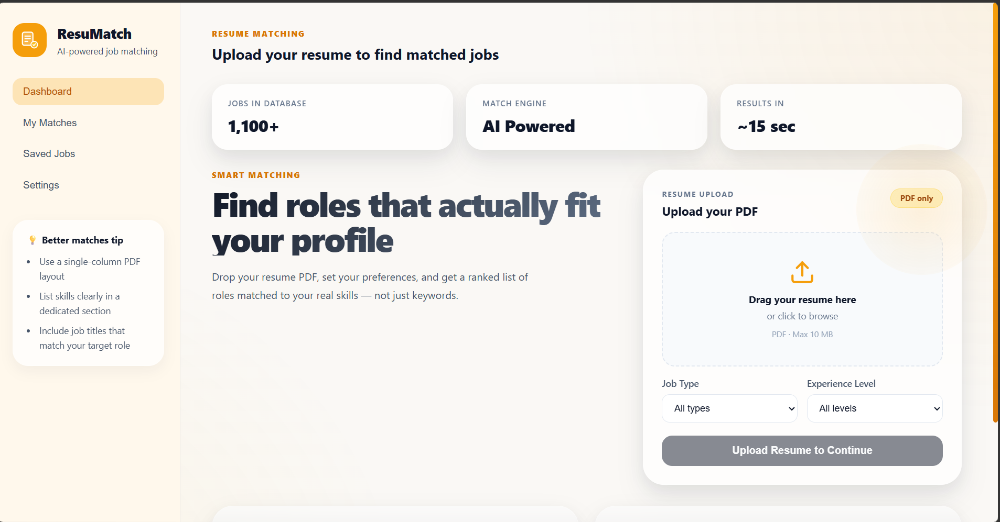
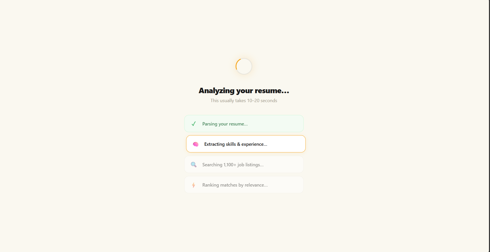
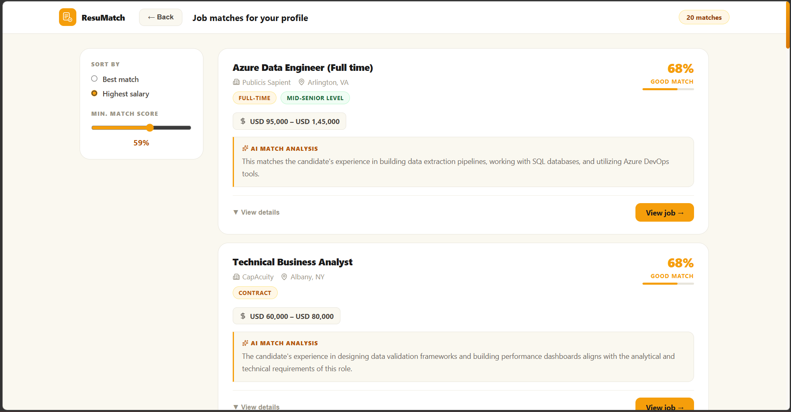
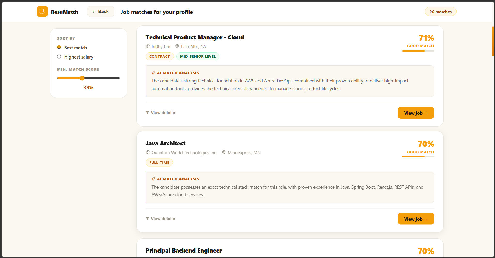
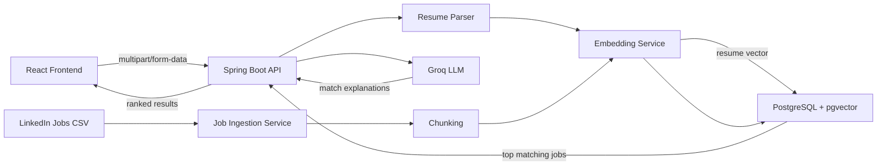

# ResuMatch

AI-powered job recommendation engine that matches resume PDFs to relevant job postings using semantic vector search and LLM-generated match explanations.

ResuMatch goes beyond keyword matching. It extracts resume text, converts it into an embedding, compares it against embedded job-description chunks in PostgreSQL using pgvector, and returns ranked job recommendations with optional filters for job type and experience level.

## Features

- Resume PDF upload and text extraction
- Semantic job matching with vector similarity search
- SQL filters for job type and experience level
- Chunk-based job embeddings for more focused retrieval
- Deduplicated results so each job appears only once
- AI-generated explanations for why each job matches the resume
- React frontend with file upload and results display

## Screenshots

### Upload Resume


### Loading


### AI-Powered Results


## Architecture



## Tech Stack

| Layer | Technology | Purpose |
|---|---|---|
| Backend | Java 21, Spring Boot 3.5 | REST API and business logic |
| AI Framework | LangChain4j 0.32 | Embedding and LLM integration |
| Embeddings | Ollama, nomic-embed-text | Local semantic embeddings |
| Vector Database | PostgreSQL, pgvector | Cosine similarity search |
| LLM | Groq, LLaMA 3.3 70B | Match explanations |
| Frontend | React.js | Resume upload and match results UI |
| Containerization | Docker | PostgreSQL and pgvector setup |

## Key Engineering Decisions

### Provider-based AI configuration

Embedding providers are selected through configuration, currently using Ollama locally:

```yaml
ai:
  embedding:
    provider: ollama
```

The configuration also includes OpenAI embedding settings, so the provider can be extended without changing the matching flow.

### Hybrid semantic search

ResuMatch combines vector similarity with relational filters:

- Vector search ranks jobs by semantic similarity to the resume.
- SQL filters narrow results by `jobType` and `experienceLevel`.
- Empty or missing filters are treated as "all jobs".

### Chunked job embeddings

Job descriptions are split into smaller overlapping chunks before embedding. This helps the search match specific skills, responsibilities, and requirements instead of averaging an entire job description into one broad vector.

### Deduplicated job results

Each job can have multiple embedded chunks. The matching query uses:

```sql
ROW_NUMBER() OVER (PARTITION BY job_id)
```

to keep only the best-matching chunk for each job, so one job does not appear multiple times in the final results.

## Prerequisites

- Java 21
- Docker Desktop
- Ollama
- Groq API key
- Node.js and npm for the frontend

Pull the embedding model:

```bash
ollama pull nomic-embed-text
```

## Database Setup

Start PostgreSQL with pgvector:

```bash
docker run --name job-rec-postgres \
  -e POSTGRES_USER=nidhish \
  -e POSTGRES_PASSWORD=password123 \
  -e POSTGRES_DB=jobrec \
  -p 5432:5432 \
  -d pgvector/pgvector:pg16
```

If the container already exists:

```bash
docker start job-rec-postgres
```

## Dataset Setup

Download the LinkedIn Job Postings dataset from Kaggle:

https://www.kaggle.com/datasets/arshkon/linkedin-job-postings

Place the CSV file here:

```text
src/main/resources/data/job_postings.csv
```

Job ingestion is controlled by:

```yaml
app:
  ingestion:
    enabled: false
```

Set it to `true` when you want to ingest jobs into the database. The current ingestion runner processes a limited number of rows for development.

## Backend Setup

Set your Groq API key.

PowerShell:

```powershell
$env:GROQ_API_KEY="your_key_here"
```

macOS/Linux:

```bash
export GROQ_API_KEY=your_key_here
```

Run the backend:

```bash
./mvnw spring-boot:run
```

On Windows:

```powershell
.\mvnw.cmd spring-boot:run
```

The backend runs on:

```text
http://localhost:8080
```

## API

### Match Resume

```http
POST /api/match
Content-Type: multipart/form-data
```

| Field | Type | Required | Description |
|---|---:|---:|---|
| `file` | PDF file | Yes | Resume PDF to match against jobs |
| `topK` | number | No | Number of matches to return. Default: `20` |
| `jobType` | string | No | Filters by job type, for example `Full-time` |
| `experienceLevel` | string | No | Filters by experience level, for example `Mid-Senior level` |

Example:

```bash
curl -X POST http://localhost:8080/api/match \
  -F "file=@resume.pdf" \
  -F "topK=20" \
  -F "jobType=Full-time" \
  -F "experienceLevel=Mid-Senior level"
```

If `jobType` or `experienceLevel` is omitted, the backend returns matches across all values for that field.

## Configuration

Main configuration lives in:

```text
src/main/resources/application.yml
```

Important settings:

| Property | Description |
|---|---|
| `spring.datasource.url` | PostgreSQL connection URL |
| `app.ingestion.enabled` | Enables CSV ingestion at startup |
| `ai.embedding.provider` | Active embedding provider |
| `ai.embedding.ollama.model` | Ollama embedding model |
| `ai.llm.groq.model` | Groq model used for explanations |
| `server.port` | Backend port |

## Roadmap

- DOCX resume support
- Docker Compose for one-command local setup
- Unit and integration tests with JUnit 5 and Mockito
- Better frontend filter controls
- Frontend deployment
- Event-driven job ingestion with Kafka
